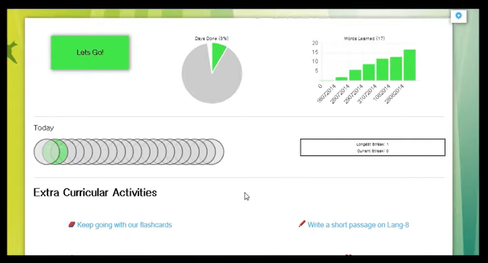

# Decypher
This was the final project I made for the CS50 online course. This was a website that creates flashcards for learning a new language in a similar style to the Babbel or DuoLingo apps. It was created when those apps were relatively new and only contained support for 2-3 languages. What sets my website apart from those apps was that my website used the Microsoft Translation API to create the flashcards dynamically for over 100 languages!

The program was designed to introduce new words and conjugations slowly, to take note of which cards you answered correctly and how recently and to alter the frequency that you get asked those cards in future correspondingly.

I made the website utilizing javascript, php, an SQL database and the Microsoft Translate API.

Unfortunately, the website is no longer hosted, but you can see a video of the site in action here: https://youtu.be/JaADR_Ck7bU

